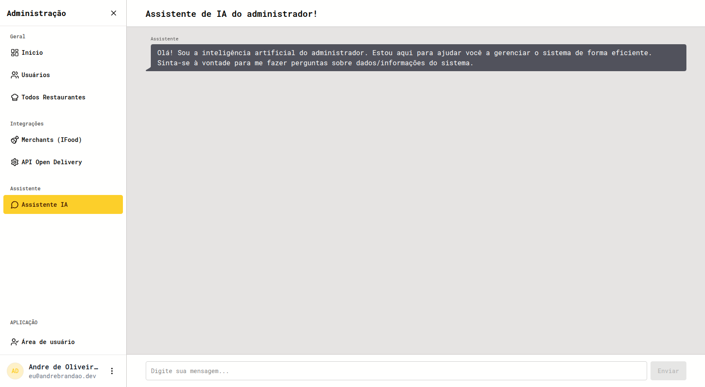

*Desenvolvido junto com meu irmão [Breno Brandão](https://github.com/brenin35).*

## Visão geral

Uma plataforma de logística de entregas para restaurantes. Os pedidos chegam dos marketplaces, são agrupados em rotas otimizadas e despachados para entregadores que as seguem em um app, enquanto quem despacha acompanha tudo em um mapa ao vivo. Também tem um armário inteligente para retirada sem contato.

## Capturas de tela

## Arquitetura

