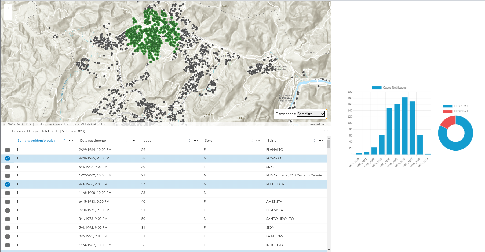
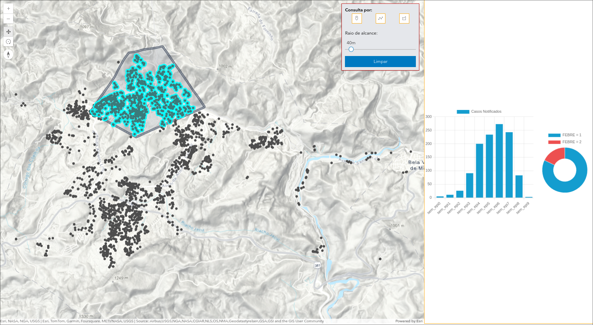
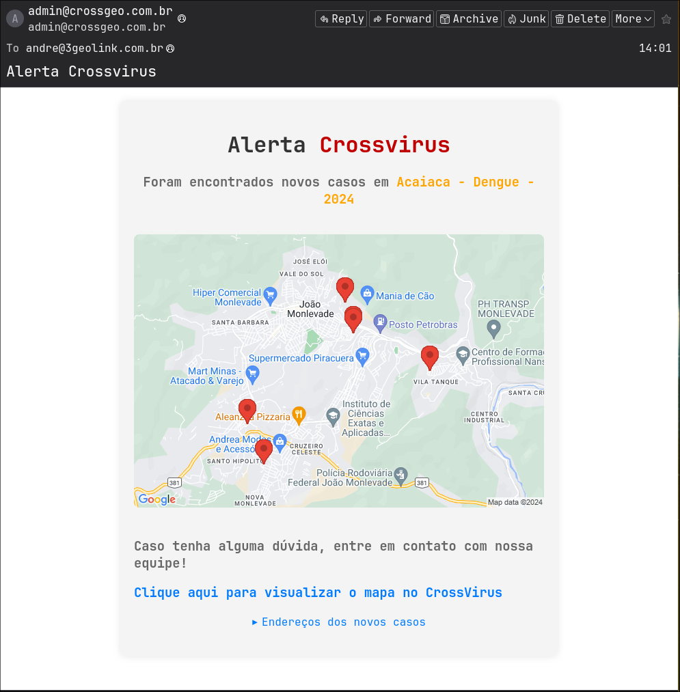

## Introduction

**CrossVirus** is a project that was initiated during the COVID-19 pandemic by my professor Sandro Laudares. The project aimed to map and control the spread of COVID-19.

In 2023, I was invited to join the project, where I contributed to the development of a platform and statistical dashboards, which were used in the cities of Divinópolis and João Monlevade to combat both **Dengue** and **COVID-19**.

This was a significant milestone in my career as it was the first large-scale professional project I took on, with the fundamental mission of mapping and controlling epidemiological diseases.

## Description

The **CrossVirus** platform employs advanced technologies such as **ArcGIS** to perform geospatial analysis of reported disease cases. The main goal is to identify critical disease hotspots and, in collaboration with local authorities, implement effective prevention and control measures.

## Geolocation of Addresses

One of the most innovative features of **CrossVirus** is its ability to import and geocode CSV files containing address data. This enables the automatic creation of detailed maps, which are essential for epidemiological analysis and monitoring.

## Drag to Search

The "drag on map" feature allows users to identify specific regions within the city or filter cases by epidemiological week, providing a comprehensive view of disease spread and aiding in quick decision-making.

## Draw to Search

The draw area or street selection feature offers an even more precise analysis of neighborhoods or localities, enabling a more targeted approach to controlling epidemics and facilitating the effective allocation of resources.

## Automatic Notification of New Cases

One of the most impactful features of **CrossVirus** is its ability to automatically notify local authorities whenever new cases are reported. As soon as a new case is registered, the system sends detailed emails with information about the affected regions, ensuring a swift and effective response to outbreaks. This proactive approach underscores **CrossVirus'** commitment to providing practical and efficient tools for disease control.

**Sample email sent**

