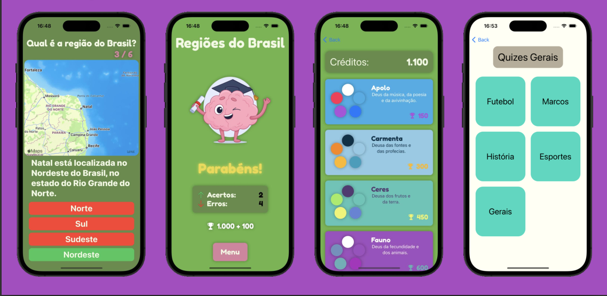

A Swift application designed for quizzes in geography, mathematics, and languages. The app provides an interactive platform for users to test their knowledge and improve their skills in these subjects.

The app was developed for the [PUC-MG HackaTruck 2023](https://hackatruck.com.br/), a hackathon sponsored by IBM, Apple, and others.

The project's code is available in this [GitHub Repository](https://github.com/andre-brandao/curiosamente).

## Features

- **Geography Quiz:** Test your knowledge of world geography with a wide range of questions about continents, countries, capitals, landmarks, and more.
- **Mathematics Quiz:** Challenge yourself with various math problems, including arithmetic, algebra, geometry, and logical puzzles.
- **Language Quiz:** Improve your language skills by answering questions related to grammar, vocabulary, comprehension, and literary devices.
- **Theme Switching:** Change the theme based on the number of points you earn from quizzes, gamifying the app and providing users with an incentive to play more and earn rewards.

#### Team Acknowledgments

- David Dias Pinto
- Leonardo Henrique S. de Avelar
- Pedro Malta Boscatti
- Samuel Marques Souza Leal
