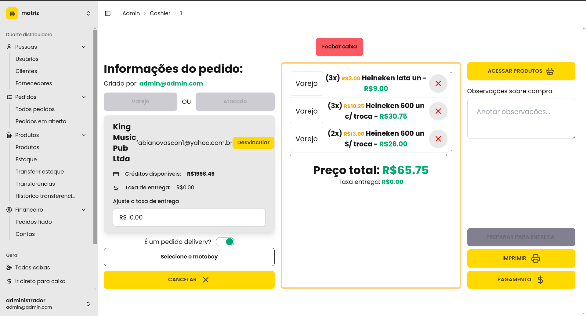

    
Project in Development

    This project is still in development. More information will be available soon.

## Introduction

This project was developed for a beverage distributor to manage inventory, sales, customers, and suppliers efficiently.

The distributor handles a large number of products, customers, and suppliers, making manual control very challenging. The system was designed to streamline the management of this data, making the process more efficient and organized.

Additionally, there are several distributor units, each requiring individual management but also allowing communication between them. We implemented a per-tenant DB model, where each distributor has its own database.

## Screenshots

- POS Cashier  
  

- Orders  
  

- TODO: Add more screenshots.

## Features

- **Inventory Management:** Control of product inflow and outflow with detailed information about each item.
- **Sales Management:** Sales recording with details about the customer, sold products, and total value.
- **Customer Management:** Customer registration, including contact information and purchase history.
- **Supplier Management:** Supplier registration with contact details and purchase history.
- **Reports:** Generation of reports on sales, inventory, and customers, with the ability to compare data across different periods.
- **Notifications:** Sending notifications about out-of-stock products, completed sales, and newly registered customers.
- **Authentication:** Authentication system ensuring that only authorized users can access the system, with individual permission controls for each user.
- **Responsiveness:** The system is responsive and accessible from any device.
- **Multi-tenant:** Each distributor unit has its own database, allowing individual management of each unit while enabling communication between them.
- **POS:** Integrated point of sale system for fast and efficient sales processing.

## Technologies Used

- **Frontend:** Svelte, TypeScript, Tailwind CSS
- **Backend:** Node.js, SQLite (Turso), DrizzleORM

TODO: finish post