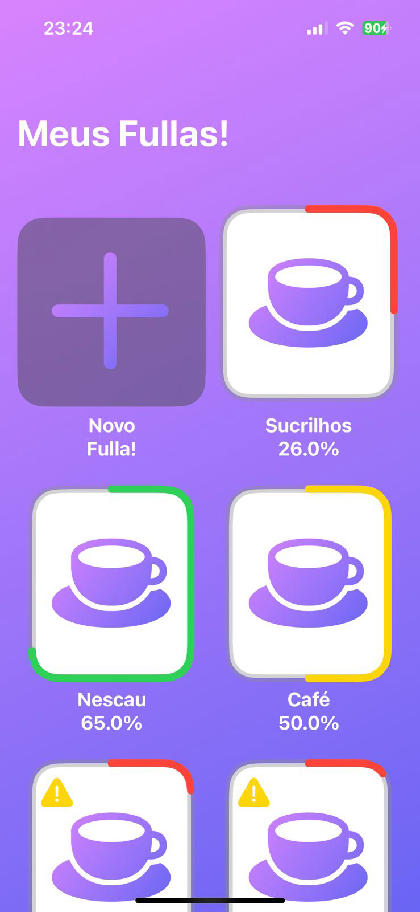
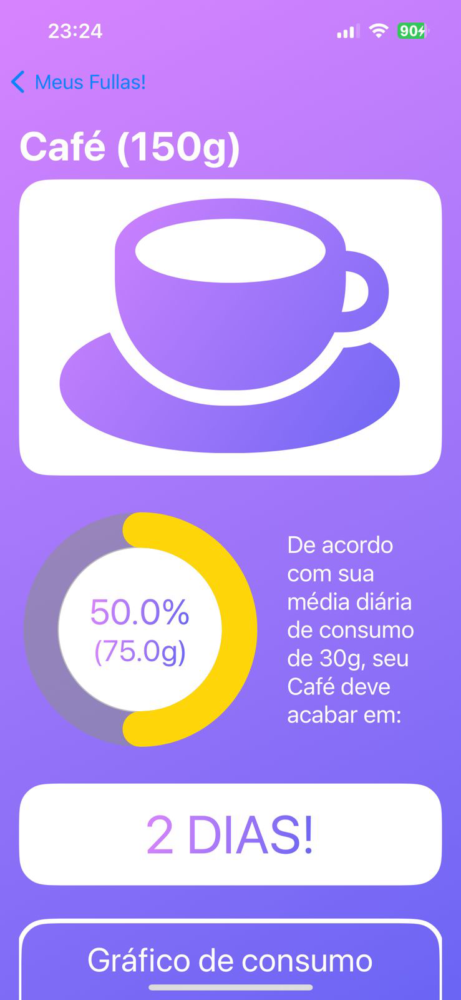
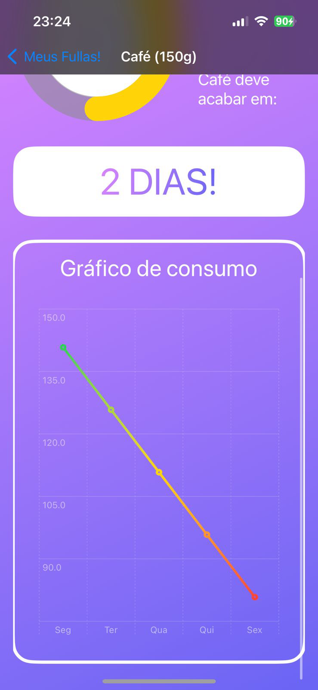
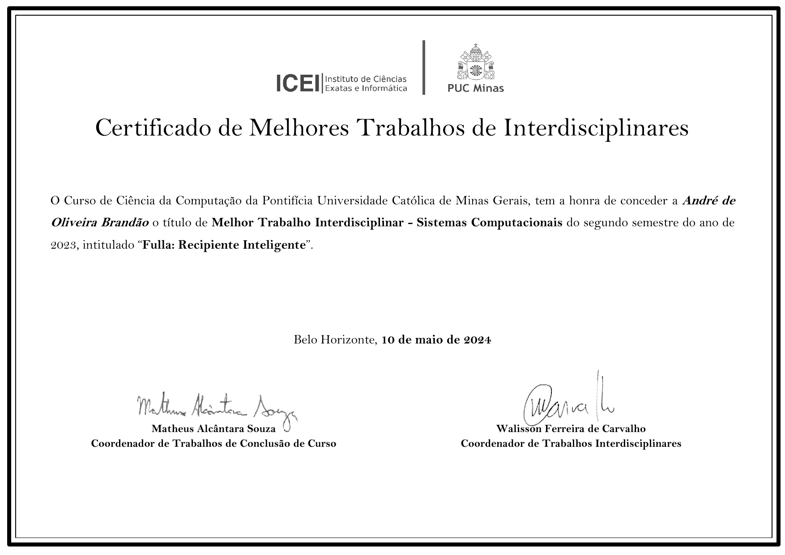

# Fulla: Real-Time Consumption Monitoring

Fulla is an innovative project developed during the TI-5 course at PUC Minas. Its main goal is to monitor and provide real-time information about the consumption of food and other household goods.

## How It Works

Fulla is a smart jar that measures the quantity of stored groceries and sends this data to an app in real-time. This allows you to track your product consumption directly from your smartphone, making it easier to manage your household inventory and reduce waste.

## Project Features

- **Real-Time Monitoring**: Receive instant updates on the quantity of groceries.
- **App Integration**: Track consumption through a dedicated app.
- **Ease of Use**: Intuitive and easy-to-configure interface.

## 3D Model Prototype

    <iframe src="https://collaborate.shapr3d.com/v/2CGl2deFHb9HDJnJ-ix2l" title="Shapr3D Webviewer" width="480" height="640" frameborder="0" allow="web-share; xr-spatial-tracking" loading="lazy" scrolling="no" referrerpolicy="origin-when-cross-origin" allowfullscreen></iframe>

During the project, a prototype was developed using an old paint jar as a base, but it was eventually lost over time.

## App Photos

    
    
    

### Certificate

## Acknowledgements

We would like to express our gratitude to the following individuals who contributed to the success of this project:

- Hugo
- Thais
- Leonardo
- Matheus
