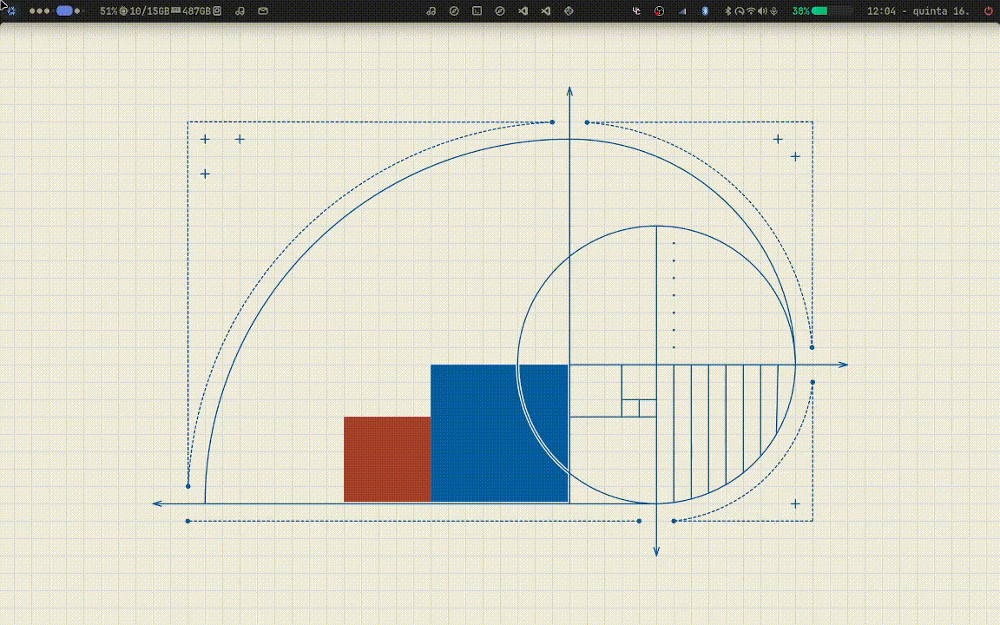
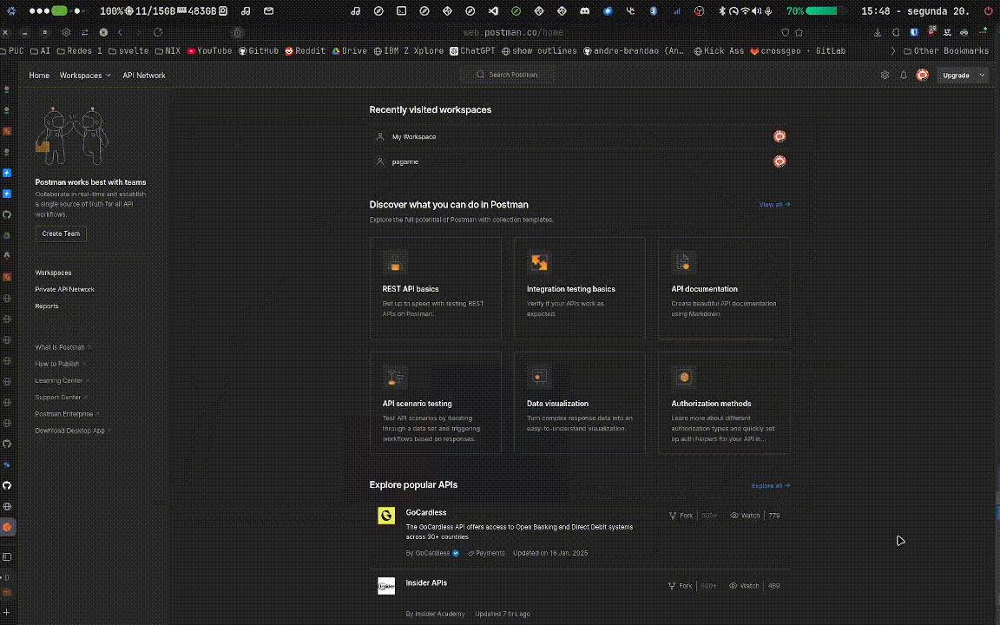

<details>
    <summary>Project In Development</summary>
    This project is constantly evolving. Check the repository for more details. <a href="https://github.com/andre-brandao/nixos">GitHub</a>
</details>

## Introduction

I grew up in Brumadinho, a small town in Minas Gerais, and didn’t have a computer to call my own. I was always passionate about `hacking` and `customizing` my devices. The first phone I bought was an iPhone 5, and I spent hours customizing it. That’s how I discovered jailbreak, which opened up a world of possibilities for me.

When I entered college, my mom gave me a great laptop that I still use today. After frustrating experiences with Windows 11, I decided to install Linux Manjaro. After a few weeks of use, I realized I would never go back to Windows. I deleted the Windows partition and installed Fedora as my main system for the next semester of college.

In the following semester, I decided to try something new, and that’s when I discovered NixOS, an operating system based on the functional package manager Nix. After overcoming the initial learning curve, I realized NixOS was the perfect system for me, and I never looked back.


```bash
andre@nixos
-----------
OS: NixOS 25.05 (Warbler) x86_64
Host: XPS 13 9300
Kernel: Linux 6.6.71
Packages: 2442 (nix-system)
Shell: zsh 5.9
Display (SHP14CB): 1920x1200 @ 60 Hz in 13 [Built-in]
WM: Hyprland 0.46.0 (Wayland)
Theme: adw-gtk3 [GTK2/3/4]
Font: JetBrains Mono (12pt) [GTK2/3/4]
Cursor: Bibata-Modern-Classic (22px)
Terminal: ghostty 1.0.2-ff9414d-nix
Terminal Font: JetBrainsMono Nerd Font (13pt)
CPU: Intel(R) Core(TM) i7-1065G7 (8) @ 3.90 GHz
GPU: Intel Iris Plus Graphics G7 @ 1.10 GHz [Integrated]
Memory: 10.45 GiB / 15.10 GiB (69%)
Swap: 6.08 GiB / 8.80 GiB (69%)
Disk (/): 435.81 GiB / 928.66 GiB (47%) - ext4
Battery (DELL 2XXFW09): 69% [Charging, AC Connected]
Locale: en_US.UTF-8
```
## Nix

Nix is a functional package manager that allows the isolated installation of packages and the creation of separate development environments. NixOS, based on Nix, lets you configure the system declaratively and create isolated development environments.

## Theming

To customize the system colors across all applications, I use Stylix, a module that allows for global color and style changes in the configuration. This way, various applications like VS Code, Chromium, GTK, and QT maintain a common theme.

### Stylix

Stylix is a module that allows global changes to colors and styles in the configuration, ensuring visual consistency across multiple applications like VS Code, Chromium, GTK, and QT.

### My Shell

I created my own shell using [AGS](https://github.com/Aylur/ags). It uses the same color repository as Stylix, enabling quick and simple customization of colors and styles.

The shell runs on Hyprland, a Wayland-based window manager that allows for dynamic workspace creation and efficient window organization.

Check out the repository on [GitHub](https://github.com/andre-brandao/hyprshell) for more details.



## Scratchpads

Additionally, I use Pyprland for creating scratchpads that provide floating windows with quick commands, and Pyprland for creating dynamic workspaces.

It's very useful for quickly accessing the terminal, WhatsApp, Spotify, and other applications with just one button.



## Nix Config

For more details, visit the [repository](https://github.com/andre-brandao/nixos).

