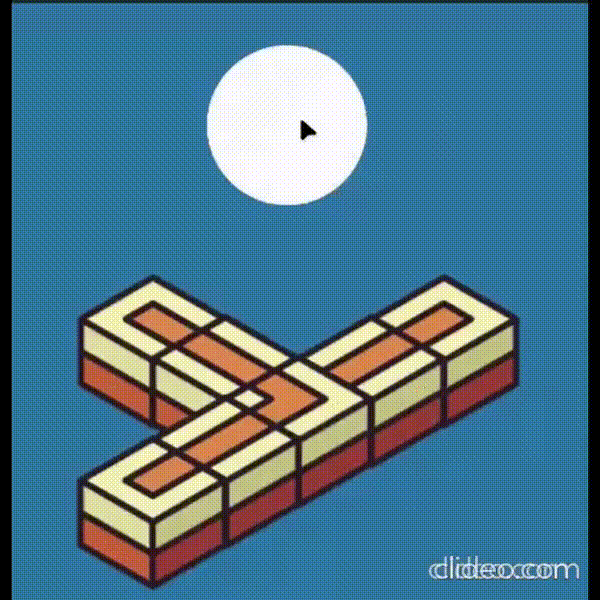
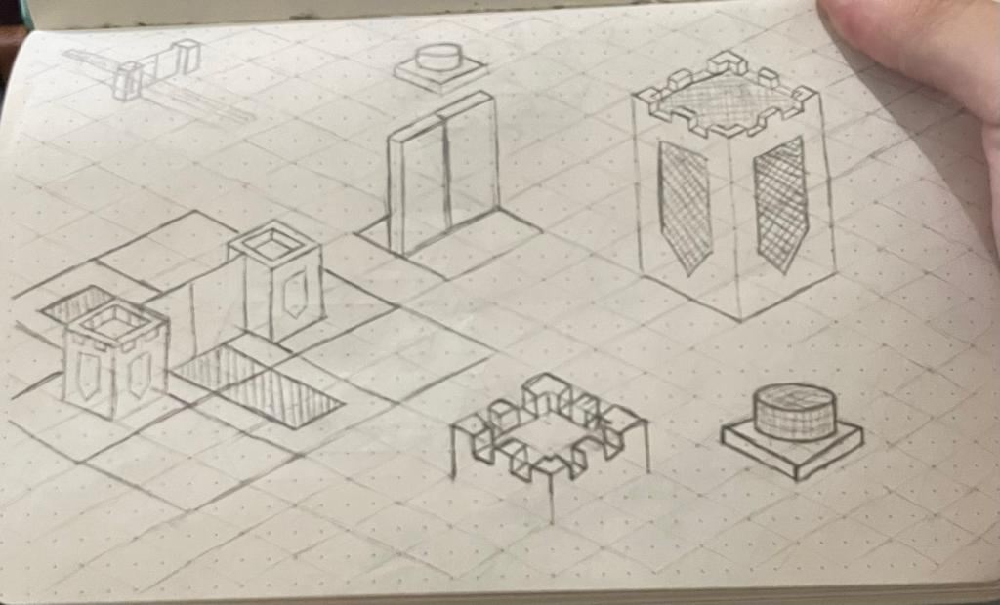
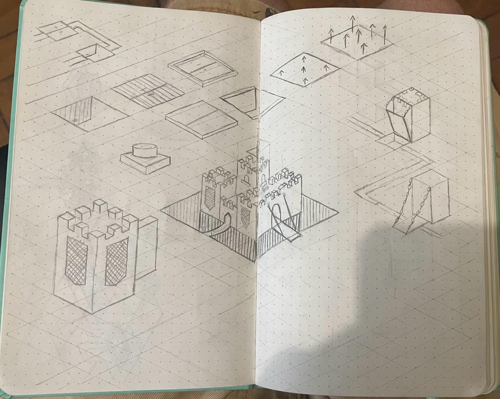

"**Maze Defense**" is a game developed in Unity for my TI-5 class at PUC-MG. This game is inspired by the 'Tower Defense' genre but with a unique twist: instead of using towers, players must strategically manipulate path intersections and control gates to guide enemies into specific traps designed to defeat particular types of mobs.

Some of the game art was created by me, but some assets were taken from the Unity Asset Store.

The game was developed using Unity and C#.

**You can access the game repository [here](https://github.com/mmarcolino/MazeDefense)**

  
One of the game maps.

## Concept Art

## Acknowledgments
 - [Matheus Marcolino]()
 - [Leonardo Faina]()
 - TODO: Add other team members
