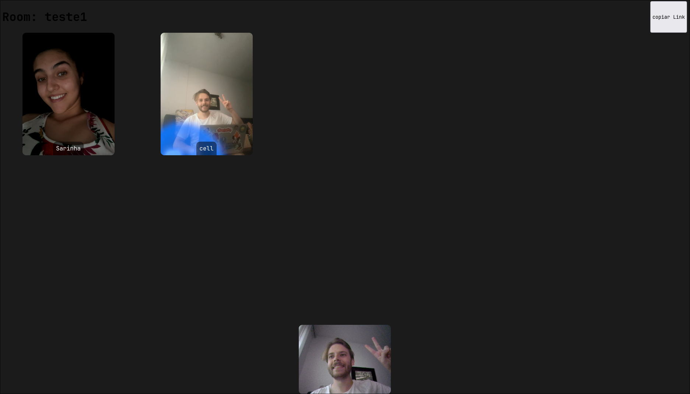
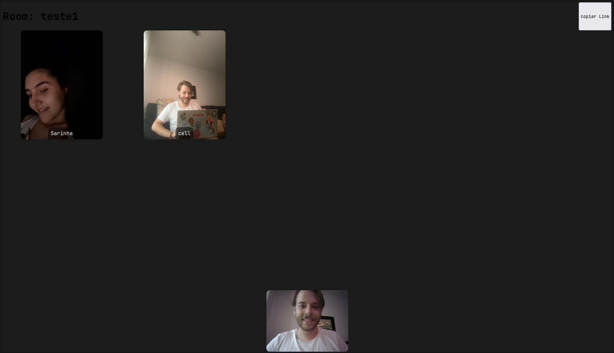

**WebRTC** is a technology that enables real-time communication between browsers. With it, you can make video calls, audio calls, and screen sharing without the need for plugins or extensions.

## Introduction

This project was developed after a practical activity in the **Software Engineering** course. The goal was to create a group video call system using **WebRTC** technology.

The original work is no longer available, but I decided to create a simpler version, focusing only on group video calls to make it accessible.

### Photos from a test call with my girlfriend and my phone:

img 1

img 2

## Repositories

[beta 2023 pure WebRTC](https://github.com/andre-brandao/svelte-rtc)

[final 2023 (peerjs)](https://github.com/andre-brandao/peerjs-svelte)

[lib 2025 (peerjs, svelte5)](https://github.com/andre-brandao/peer-svelte)

## Try it yourself

This version of the project doesn't require a database, and all data is stored in the browser or RAM. To test it, just access the link below, create a room, and share the link with your friends.

Website link: [Access here](https://meet.andrebrandao.dev/)
