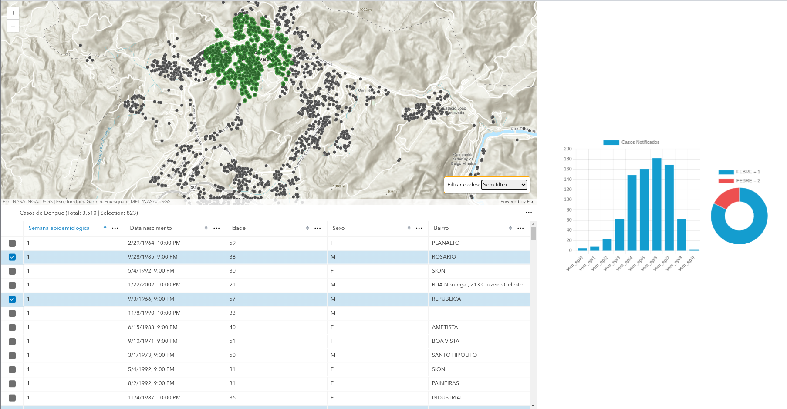
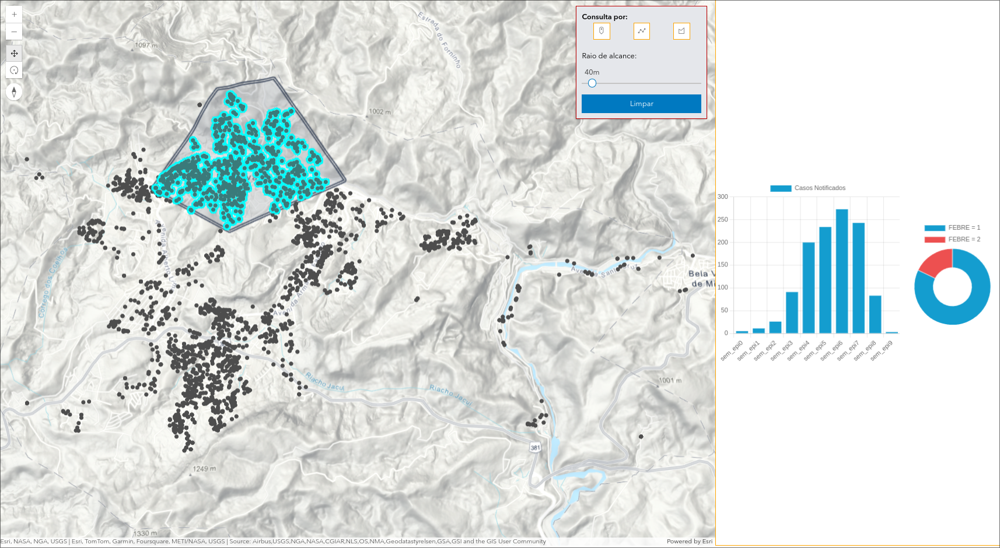
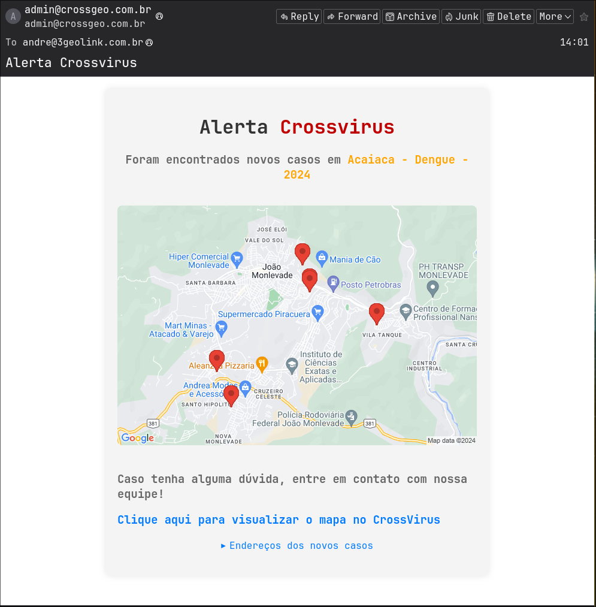

## Introdução
CrossVirus foi um projeto iniciado durante a epoca da pandemia de COVID-19. O projeto foi desenvolvido para mapear e controlar o avanço do COVID-19 em Belo Horizonte, Minas Gerais. O projeto foi desenvolvido em colaboração com a prefeitura de João Monlevade.

Em 2023 eu fui convidado para participar do projeto desenvolvendo uma plataforma e dashboards estatisticas que foram utilizadas em Divinópolis e João Monlevade para combater a Dengue e o COVID.

Foi também um marco significativo, sendo o primeiro projeto que assumi profissionalmente. Possui uma missão fundamental: mapear e controlar doenças epidemiológicas.

## Descrição
Esta inovadora plataforma emprega tecnologias como o ArcGIS para realizar análises geoespaciais de casos reportados ao governo. O objetivo é identificar pontos críticos de doenças e, em colaboração com as autoridades locais, implementar medidas eficazes de combate.

## Geolocalização de Endereços
Uma das características mais notáveis do CrossVirus é a sua capacidade de importar e geocodificar qualquer arquivo CSV com informações de endereço. Isso permite a criação automática de mapas detalhados, fundamentais para a análise epidemiológica.

## Arraste para Pesquisar

O recurso de arrastar no mapa facilita a identificação de regiões específicas da cidade ou a filtragem de casos por semana epidemiológica, proporcionando uma visão abrangente da propagação da doença.

## Desenhe para Pesquisar

Com a opção de desenhar áreas ou selecionar ruas, este recurso oferece uma análise ainda mais precisa de bairros ou localidades, permitindo uma abordagem cirúrgica no combate às epidemias.

## Notificação Automática de Novos Casos
Uma das funcionalidades essenciais do CrossVirus é a capacidade de notificar automaticamente as autoridades locais sobre novos casos. Assim que novas ocorrências são registradas, o sistema envia e-mails detalhados com as regiões afetadas, permitindo uma resposta rápida e eficaz no combate às epidemias. Essa abordagem proativa destaca o compromisso do CrossVirus em fornecer ferramentas práticas e eficientes para o controle de doenças epidemiológicas.

** Email exemplo