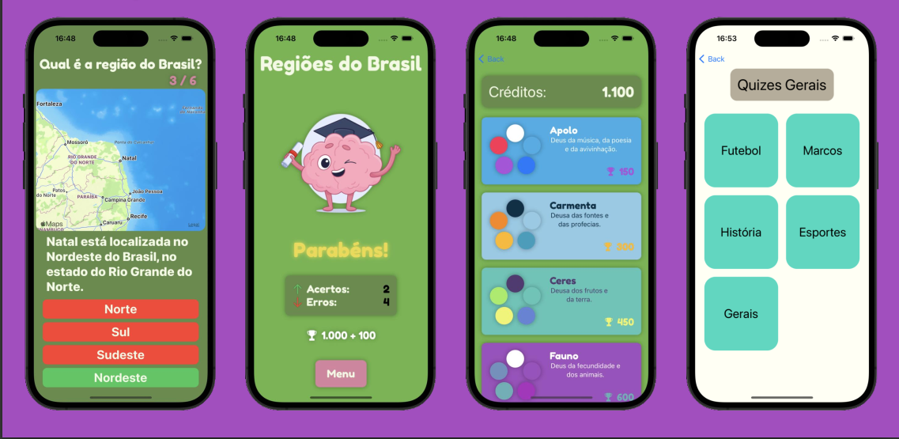

Um aplicativo em Swift para realizar quizzes nas áreas de geografia, matemática e línguas. O aplicativo oferece uma plataforma interativa para os usuários testarem seus conhecimentos e melhorarem suas habilidades nesses assuntos.

O aplicativo foi desenvolvido para o [PUC-MG HackaTruck 2023](https://hackatruck.com.br/), um hackathon promovido pela IBM, Apple e outros.

O código do projeto está disponível neste [Repositório no Github](https://github.com/andre-brandao/curiosamente).

## Funcionalidades

- **Quiz de Geografia:** Teste seus conhecimentos de geografia mundial com uma ampla variedade de perguntas sobre continentes, países, capitais, marcos e muito mais.
- **Quiz de Matemática:** Desafie-se com vários problemas matemáticos, incluindo aritmética, álgebra, geometria e quebra-cabeças lógicos.
- **Quiz de Texto:** Melhore suas habilidades linguísticas respondendo perguntas relacionadas a gramática, vocabulário, compreensão e dispositivos literários.
- **Mudança de Tema:** Altere o tema com base na quantidade de pontos que você ganhou fazendo quizzes, gamificando o aplicativo e dando ao usuário um incentivo para jogar mais e ganhar recompensas.

#### Agradecimentos à equipe

- David Dias Pinto
- Leonardo Henrique S. de Avelar
- Pedro Malta Boscatti
- Samuel Marques Souza Leal
