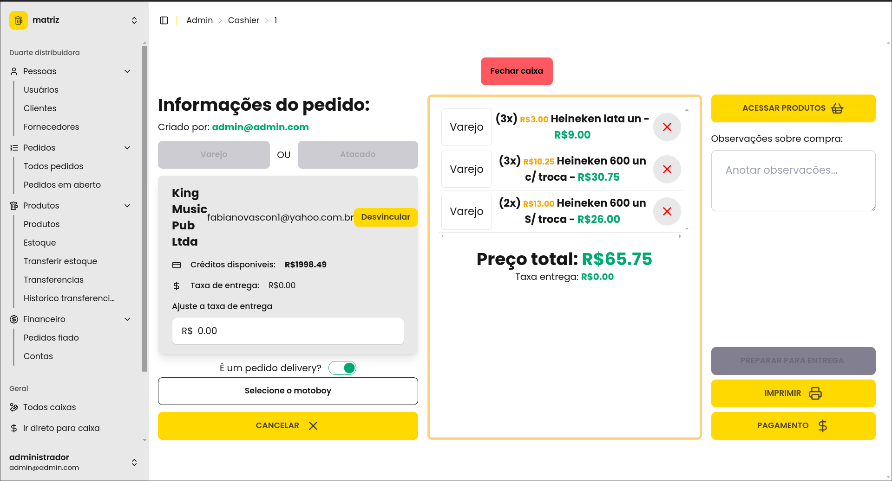
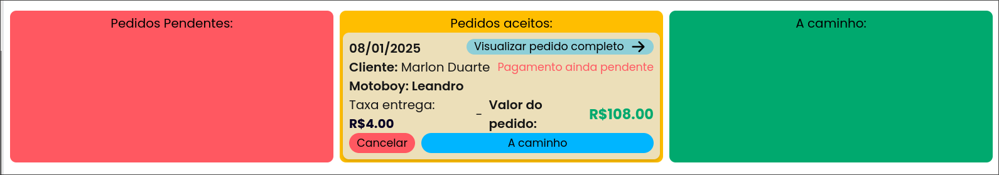

    
Projeto Em Desenvolvimento

    Esse projeto ainda está em desenvolvimento. Mais informações em breve.

## Introdução

Esse foi um projeto desenvolvido para uma distribuidora de bebidas. O sistema foi feito para gerenciar o estoque, vendas, clientes e fornecedores da empresa.

A distribuidora conta com um grande número de produtos, clientes e fornecedores, o que torna o controle manual muito difícil. O sistema foi desenvolvido para facilitar a gestão desses dados, tornando o processo mais eficiente e organizado.

Além disso existem varias unidades da distribuidora, e havia a necessidade de um sistema capaz de gerenciar todas as unidades de forma individual, mas também permitindo a comunicação entre elas.
 FOi utilizado o modelo per-tenant db onde cada distribuidora tem seu proprio banco de dados.

## Capturas de Tela

- PDV Caixa

- Pedidos

- TODO: add screenshots

## Funcionalidades

- **Gestão de Estoque:** Controle de entrada e saída de produtos, com informações detalhadas sobre cada item.
- **Gestão de Vendas:** Registro de vendas, com informações sobre o cliente, produtos vendidos e valor total.
- **Gestão de Clientes:** Cadastro de clientes, com informações de contato e histórico de compras.
- **Gestão de Fornecedores:** Cadastro de fornecedores, com informações de contato e histórico de compras.
- **Relatórios:** Geração de relatórios sobre vendas, estoque e clientes. Com a possibilidade de comparar dados em diferentes períodos.
- **Notificações:** Envio de notificações sobre produtos em falta, vendas realizadas e novos clientes cadastrados.
- **Autenticação:** Sistema de autenticação para garantir que apenas usuários autorizados possam acessar o sistema, além do controle de permissões individual de cada usuario.
- **Responsividade:** O sistema é responsivo, podendo ser acessado de qualquer dispositivo.
- **Multi-tenant:** Cada unidade da distribuidora tem seu proprio banco de dados, permitindo a gestão individual de cada unidade, mas também a comunicação entre elas.
- **PDV:** Ponto de venda integrado ao sistema, permitindo a realização de vendas de forma rápida e eficiente.

## Tecnologias Utilizadas

- **Frontend:** Svelte, TypeScript, Tailwind CSS
- **Backend:** Node.js, SQLite (Turso), DrizzleORM

## Banco de Dados

O banco de dados utilizado foi um diferencial no projeto. Utilizamos o SQLite com o Turso, um ORM desenvolvido por nós. O Turso é um ORM simples e eficiente, que facilita a criação e manipulação de bancos de dados SQLite.

A escolha foi feita pois a distribuidora não precisava de uma banco de dados complexo, mas de uma forma de gerenciar multiplos bancos de dados de forma eficiente.

Dessa forma temos um banco de dados para cada unidade da distribuidora, e um banco de dados central para gerenciar as informações de todas as unidades.