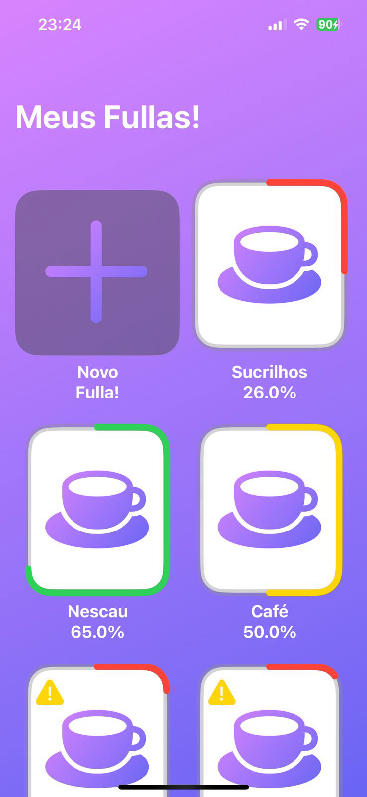
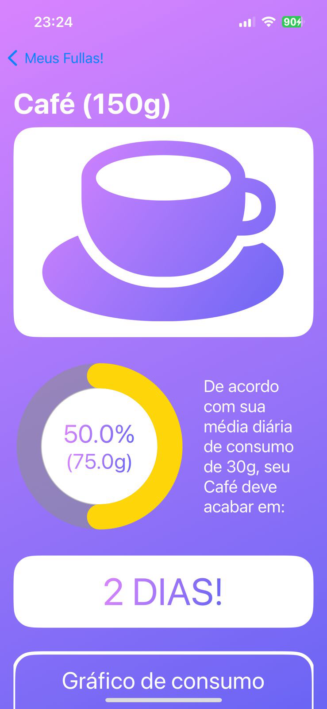
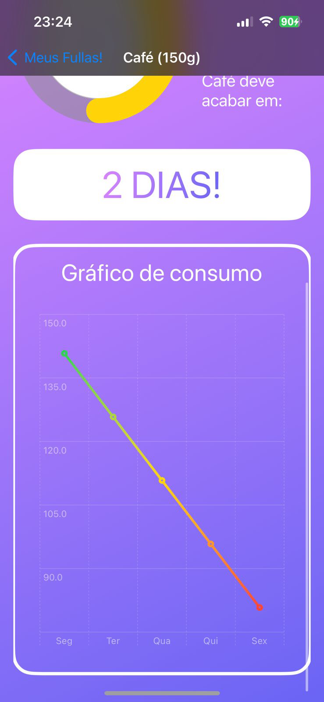
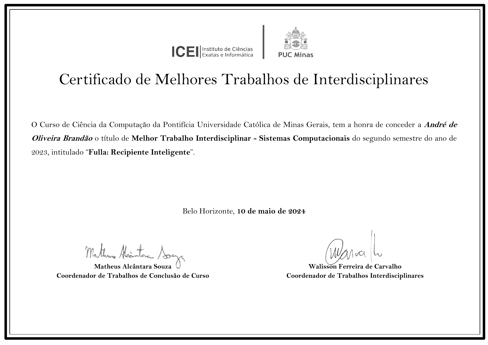

# Fulla: Monitoramento de Consumo em Tempo Real

Fulla é um projeto inovador desenvolvido durante a disciplina de TI-5 na PUC Minas. O principal objetivo do Fulla é monitorar e fornecer informações em tempo real sobre o consumo de alimentos e outros bens em sua casa.

## Como Funciona

O Fulla é um pote inteligente que mede a quantidade de mantimentos armazenados e envia essas informações para um aplicativo em tempo real. Com isso, você pode acompanhar o consumo dos seus produtos diretamente pelo seu smartphone, facilitando a gestão do estoque doméstico e evitando desperdícios.

## Características do Projeto

- **Monitoramento em Tempo Real**: Receba atualizações instantâneas sobre a quantidade de mantimentos.
- **Integração com Aplicativo**: Acompanhe o consumo através de um aplicativo dedicado.
- **Facilidade de Uso**: Interface intuitiva e de fácil configuração.

## 3D Model Prototype

    <iframe src="https://collaborate.shapr3d.com/v/2CGl2deFHb9HDJnJ-ix2l" title="Shapr3D Webviewer" width="480" height="640" frameborder="0" allow="web-share; xr-spatial-tracking" loading="lazy" scrolling="no" referrerpolicy="origin-when-cross-origin" allowfullscreen></iframe>

Durante o projeto foi desenvolvido um prototipo utiliando um pote velho de tinta para a base, mas ele se perdeu com o tempo.

## Fotos do App

    
    
    

### Certificado

## Agradecimentos

Gostaríamos de expressar nossa gratidão às seguintes pessoas que contribuíram para o sucesso deste projeto:

- Hugo
- Thais
- Leonardo
- Matheus

