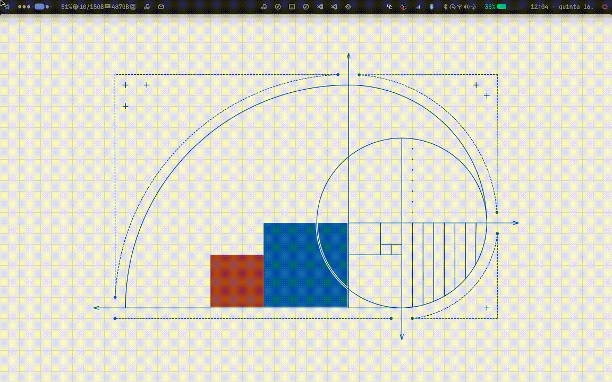
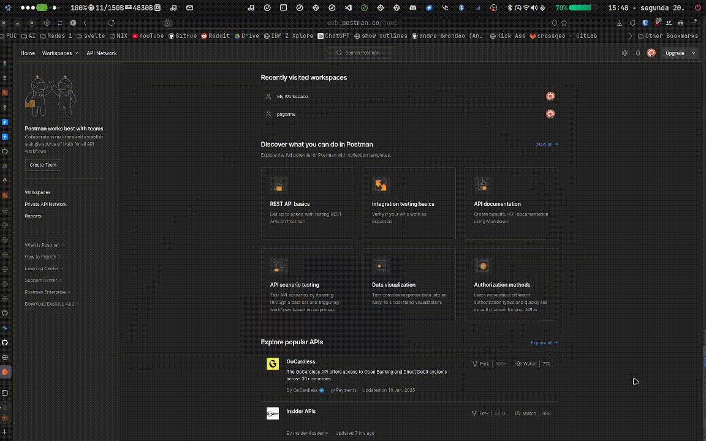

## Introdução

Cresci em Brumadinho, no interior de Minas Gerais, e não tive um computador para chamar de meu. Sempre fui apaixonado por `hackear` e `customizar` meus aparelhos. O primeiro celular que comprei foi um iPhone 5, e passei horas customizando-o. Foi assim que descobri o jailbreak, que me apresentou a esse mundo de possibilidades.

Quando entrei na faculdade, minha mãe me deu um ótimo notebook, que uso até hoje. Após experiências frustrantes com o Windows 11, decidi instalar o Linux Manjaro. Depois de algumas semanas de uso, percebi que nunca mais voltaria para o Windows. Excluí a partição do Windows e instalei o Fedora como meu sistema principal para o próximo semestre da faculdade.

No semestre seguinte, decidi experimentar algo novo e foi aí que descobri o NixOS, um sistema operacional baseado no gerenciador de pacotes funcional Nix. Após superar a curva inicial de aprendizado, percebi que o NixOS era o sistema perfeito para mim, e nunca mais olhei para trás.

## Nix

Nix é um gerenciador de pacotes funcional que permite a instalação de pacotes de forma isolada e a criação de ambientes de desenvolvimento separados. O NixOS, baseado em Nix, permite configurar o sistema de forma declarativa e criar ambientes isolados para desenvolvimento.


## Meu setup
```bash
andre@nixos
-----------
OS: NixOS 25.05 (Warbler) x86_64
Host: XPS 13 9300
Kernel: Linux 6.6.71
Packages: 2442 (nix-system)
Shell: zsh 5.9
Display (SHP14CB): 1920x1200 @ 60 Hz in 13 [Built-in]
WM: Hyprland 0.46.0 (Wayland)
Theme: adw-gtk3 [GTK2/3/4]
Font: JetBrains Mono (12pt) [GTK2/3/4]
Cursor: Bibata-Modern-Classic (22px)
Terminal: ghostty 1.0.2-ff9414d-nix
Terminal Font: JetBrainsMono Nerd Font (13pt)
CPU: Intel(R) Core(TM) i7-1065G7 (8) @ 3.90 GHz
GPU: Intel Iris Plus Graphics G7 @ 1.10 GHz [Integrated]
Memory: 10.45 GiB / 15.10 GiB (69%)
Swap: 6.08 GiB / 8.80 GiB (69%)
Disk (/): 435.81 GiB / 928.66 GiB (47%) - ext4
Battery (DELL 2XXFW09): 69% [Charging, AC Connected]
Locale: en_US.UTF-8
```

## Theming
Para customizar as cores do sistema em todos os aplicativos, estou usando o Stylix, um módulo que permite alterar cores e estilos globalmente na configuração. Assim, diversos aplicativos como VS Code, Chromium, GTK e QT mantêm um tema comum.

### Stylix

Stylix é um módulo que permite alterar cores e estilos globalmente na configuração, garantindo consistência visual entre vários aplicativos, como VS Code, Chromium, GTK e QT.

### Minha Shell

Eu criei minha propria shell utilizando [AGS](https://github.com/Aylur/ags). Ela utiliza o mesmo repositório de cores do Stylix e permite customizações rápidas e simples de cores e estilos.

A shell funciona com o Hyprland, um gerenciador de janelas baseado em Wayland que permite a criação de workspaces dinâmicos e a organização eficiente de janelas.

Confira o repositório no [GitHub](https://github.com/andre-brandao/hyprshell) para saber mais.





## Scratchpads 

Alem disso utilizo pyprland para a criacao de scratchpads que me permitem ter janelas flutuantes com comandos rapidos, e o pyprland para a criação de workspaces dinamicos.

Muito util para acessar o terminal, WhatsApp, Spotify, e outros aplicativos rapidamente com apenas um butao.



## Nix Config

Para mais detalhes acesse o [repositorio](https://github.com/andre-brandao/nixos)