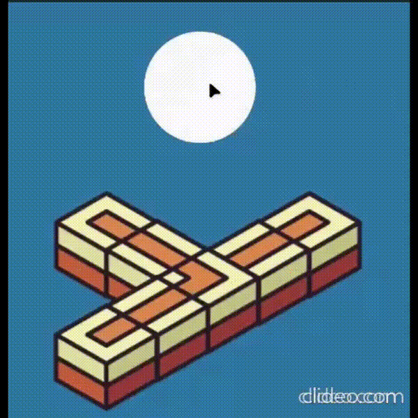
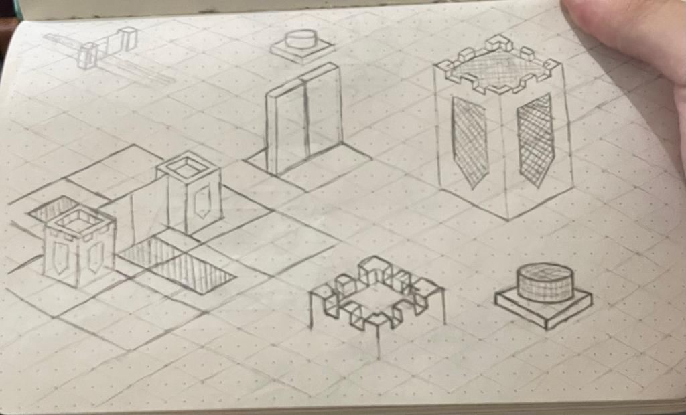
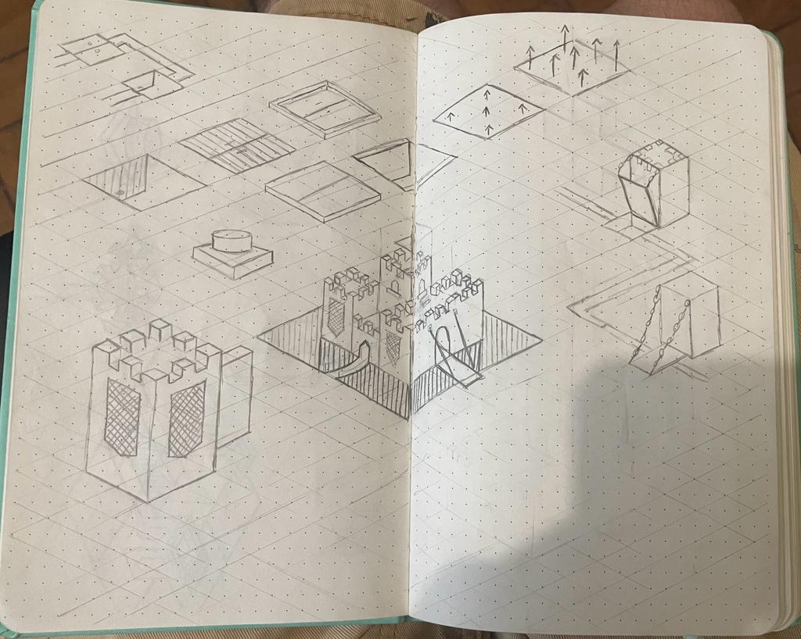

"**Maze Defense**" é um jogo desenvolvido em Unity para minha disciplina de TI-5 na PUC-MG. Este jogo se inspira no gênero 'Tower Defense', mas com um toque único: em vez de usar torres, os jogadores devem manipular estrategicamente interseções de caminhos e controlar portões para guiar inimigos a armadilhas específicas, projetadas para derrotar tipos particulares de mobs.

Algumas das artes do jogo foram feitas por mim, mas alguns assets foram retirados da Unity Asset Store.

O jogo foi desenvolvido usando Unity e C#.

**Você pode acessar o repositório do jogo [aqui](https://github.com/mmarcolino/MazeDefense)**

  
Um dos mapas do jogo.

## Arte conceitual

---
