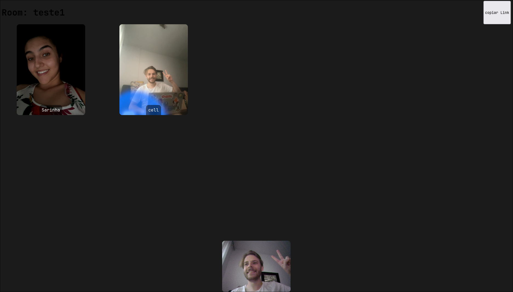
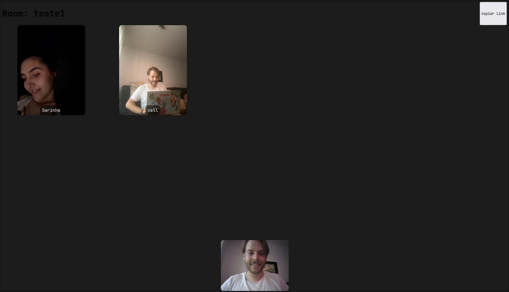

O **WebRTC** é uma tecnologia que permite a comunicação em tempo real entre navegadores. Com ele, é possível realizar chamadas de vídeo, áudio e compartilhamento de tela sem a necessidade de plugins ou extensões.

## Introdução

Esse projeto foi desenvolvido após uma atividade pratica da disciplina de **Engenharia de Softare**. O objetivo era criar um sistema de chamadas de vídeo em grupo utilizando a tecnologia **WebRTC**.

O trabalho original não está mais disponível, mas decidi continuar criar uma versão mais simples, apenas com chamadas de vídeo em grupo para disponibilizar.

### Fotos de uma chamada teste com minha namorada e meu celular:

img 1

img 2

## Repositorios

[beta 2023 pure WebRTC](https://github.com/andre-brandao/svelte-rtc)

[final 2023 (peerjs)](https://github.com/andre-brandao/peerjs-svelte)

[lib 2025 (peerjs, svelte5)](https://github.com/andre-brandao/peer-svelte)

## Teste você mesmo 

Essa versão do projeto não necessita de um banco de dados e todos os dados são armazenados no navegador ou em RAM. Para testar, basta acessar o link abaixo, criar uma sala e compartilhar o link com seus amigos.

Link do site: [Acesse aqui](https://meet.andrebrandao.dev/)