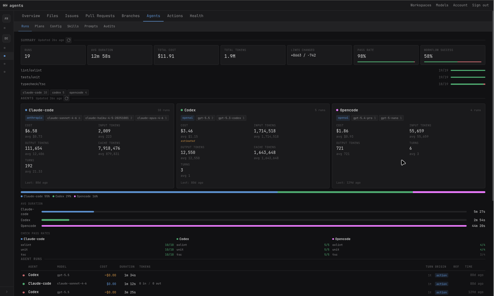
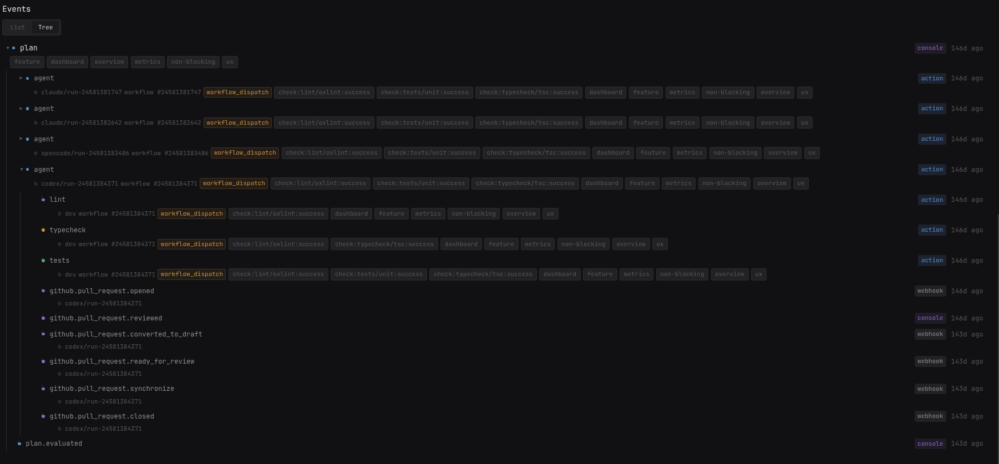
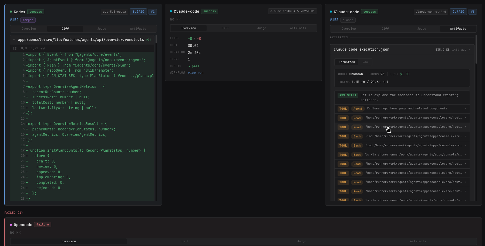
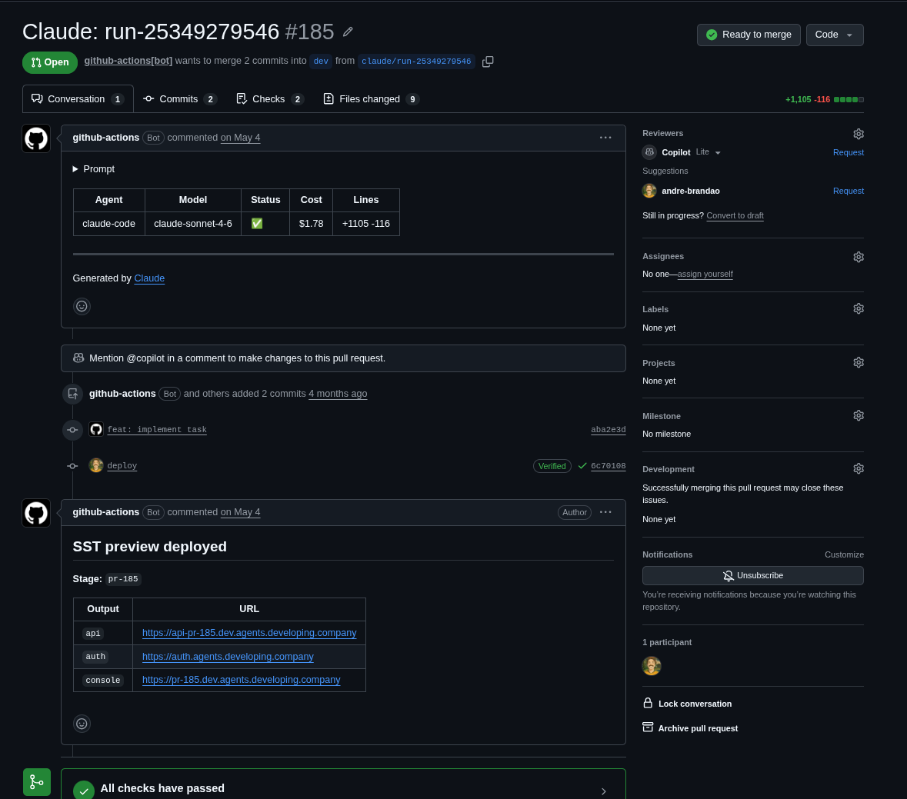

    
Em desenvolvimento, pausado por enquanto

    O Dev Agents ainda precisa de trabalho. Construí-lo foi o que me levou a começar o <a href="/pt/projects/sandboxd/">Sandboxd</a>, e o desenvolvimento continua quando o Sandboxd estiver mais maduro. Acompanhe no <a href="https://github.com/developing-software/agents">GitHub</a>.

## Visão geral

O Dev Agents é um orquestrador de agentes de código trabalhando dentro de bases de código existentes. Ele decide o que roda, onde e com qual agente, e mantém todos os resultados à vista. O fluxo tem três passos: uma pessoa revisa e aprova um plano, os agentes o implementam, e tudo o que eles fazem é acompanhado por eventos do repositório, verificações de saúde e revisões de código.

Ele é feito para repositórios brownfield, aqueles com histórico, convenções e coisas que quebram, e não para demos do zero.

- **Planejamento**: os planos são escritos e esperam a aprovação de uma pessoa.
- **Implementação**: os planos aprovados vão para os agentes, que fazem o trabalho no repositório.
- **Acompanhamento**: pull requests, checks e revisões voltam para o console, então nada acontece sem ser visto.

O repositório é um monorepo em Bun com a lógica central, funções serverless para a API e os webhooks, a UI do console e as actions de workflow, implantado com SST.

## O mesmo plano, vários agentes

Um plano pode ir para mais de um agente ao mesmo tempo, hoje Claude Code, Codex e Opencode. Cada execução ganha seu próprio pull request, checks, custo e uma nota do juiz, então os resultados ficam lado a lado e o melhor é o que faz merge.

## CI/CD e ambientes de preview

Toda execução de agente termina em um pull request normal. O bot abre o PR com o prompt, o modelo, o custo e as linhas alteradas, os workflows de lint, teste e typecheck rodam nele, e um ambiente de preview é implantado só para aquele PR, com URLs próprias de API, auth e console. Revisar o trabalho de um agente é clicar em um link, não fazer checkout de uma branch.

## Onde entra o Sandboxd

Agentes precisam de um lugar seguro para rodar: um ambiente descartável com o repositório clonado, um terminal que dá para observar e nada para limpar depois. Essa necessidade virou um projeto próprio, o [Sandboxd](/pt/projects/sandboxd/), e o Dev Agents vai rodar em cima dele.
