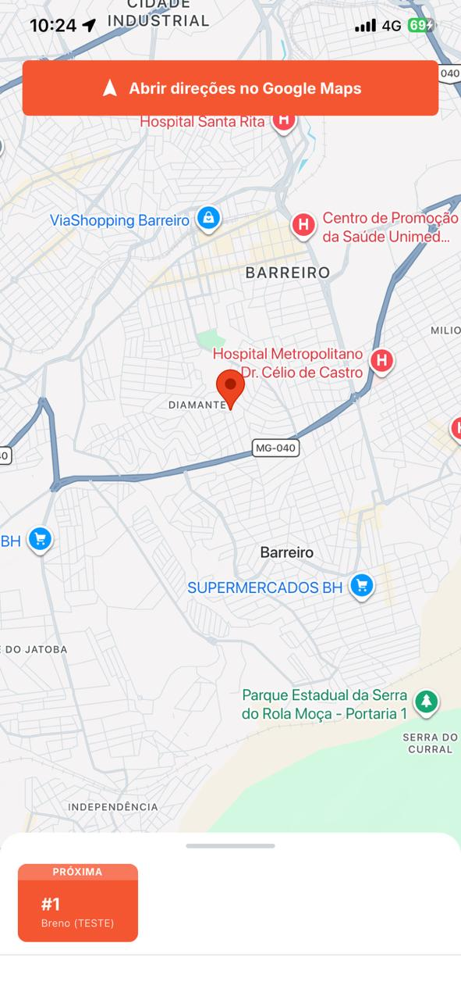
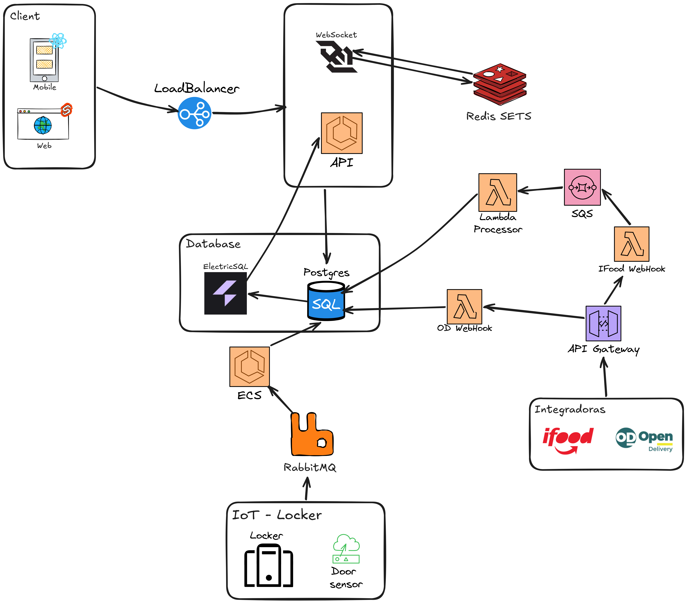

*Built together with my brother [Breno Brandão](https://github.com/brenin35).*

## Overview

Rota do Futuro is a delivery logistics platform for restaurants. Orders come in from marketplaces such as iFood, Saipos and Open Delivery, get grouped into optimized routes, and are dispatched to couriers who follow them in a mobile app. Dispatchers watch everything happen on a live map.

The product has three parts: a web platform for restaurants and dispatchers, a mobile app for couriers, and a smart locker for contactless pickup.

## Web platform

- **Live map**: couriers and orders tracked in real time over WebSockets.
- **Route optimization**: orders grouped into delivery sequences that minimize distance.
- **Order board**: every order moves through pending, confirmed, ready, collected, dispatched and completed.
- **Marketplace integrations**: iFood, Saipos and Open Delivery orders synced automatically.
- **Reports**: per-courier deliveries, distance covered and amounts to pay for any period.
- **Admin assistant**: an AI assistant that answers questions about the system's data.

## Courier app

Couriers receive their assigned routes on the phone, navigate stop by stop with the maps app of their choice, and confirm each delivery. Status flows back to the dispatch board immediately.

## Smart locker

A locker built on an ESP32 that opens the right door when a courier collects an order. It talks to the platform over MQTT, so door and order status stay in sync with the web and mobile apps.

## Architecture

- **Frontend**: SvelteKit for the web platform, React Native for the courier app.
- **API**: a single API with WebSocket support for live updates, backed by Redis sets for presence and positions.
- **Database**: PostgreSQL with PostGIS for geographic queries, plus ElectricSQL for sync.
- **Messaging**: RabbitMQ between the locker, the integrations and the API.
- **Integrations**: marketplace webhooks handled by AWS Lambda behind API Gateway and EventBridge.

## Challenges

- Processing large volumes of orders while keeping the map responsive.
- Route optimization that stays fast as the number of stops grows.
- Reliable asynchronous work across queues, lambdas and the locker hardware.
