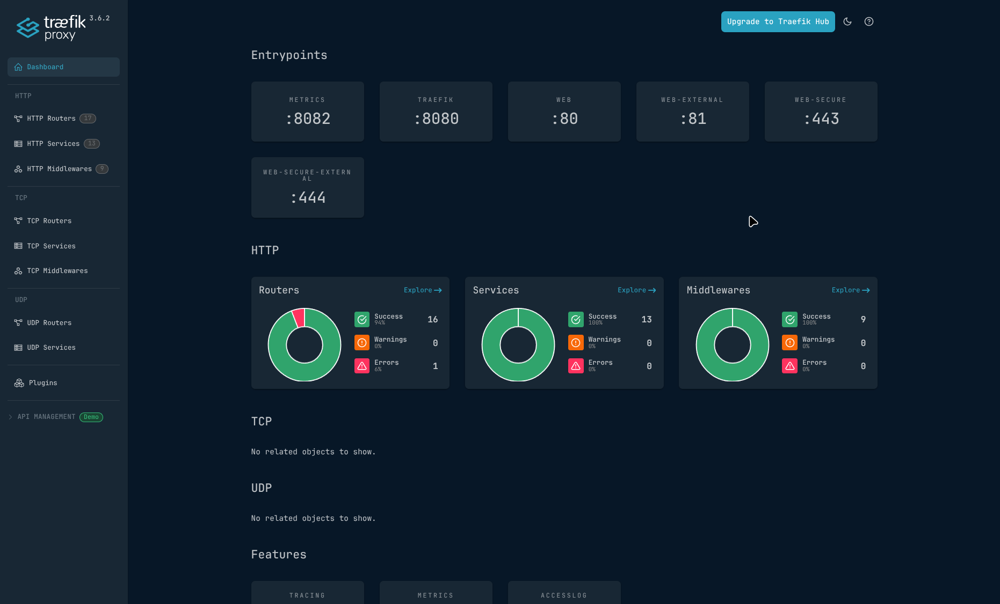

    
Always changing

    Everything here is declared in one flake that keeps evolving. The current state lives on <a href="https://github.com/andre-brandao/nixos">GitHub</a>.

## Overview

One Proxmox host, one NixOS virtual machine per service, and nothing configured by hand. Adding a machine is creating a folder in the flake and running Terraform, which creates the VM, installs NixOS on it and keeps it updated. Everything talks over Tailscale with proper HTTPS, and secrets live encrypted in the repo.

## Storage

TrueNAS runs as a VM too, with the hard drives passed through from the host as whole disks, by id. ZFS inside TrueNAS owns the physical disks, so the pool is the same one it would be on bare metal and can move to another box with no import tricks. It is the main storage of the lab and also hosts the MinIO bucket that keeps the Terraform state.

## The machines

- **mine**: Minecraft server
- **git**: Forgejo with an Actions runner
- **vault**: Vaultwarden and HashiCorp Vault
- **builder**: remote Nix builder
- **monitoring**: Prometheus and a LiteLLM gateway

## The Minecraft server

Declared with `nix-minecraft`, so a rebuild reproduces the exact same server, mods included. Fabric 1.21.11, Lithium for performance, and BlueMap for a live 3D map of the world in the browser. Java and Bedrock players can both join.

## Always learning

The lab is where I try things out, so it never sits still. To see what is being experimented with right now, check the [repository](https://github.com/andre-brandao/nixos).
