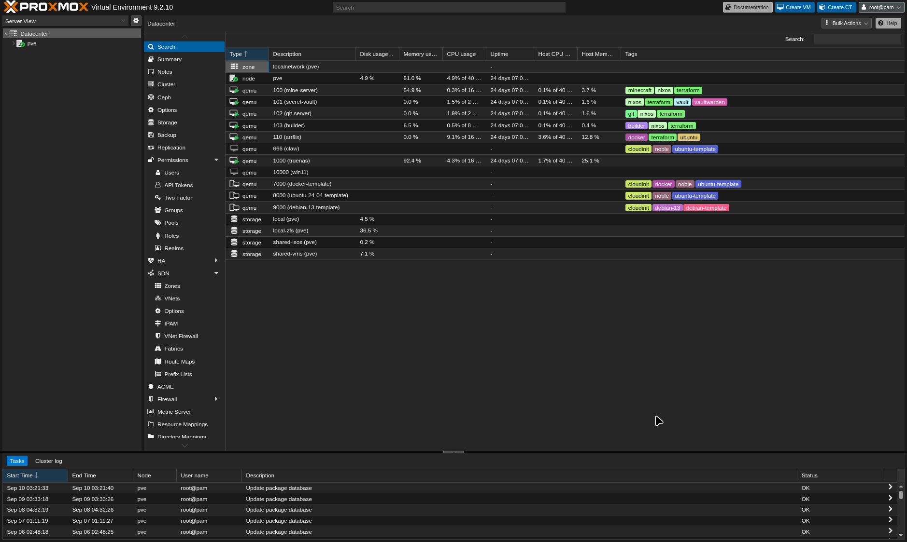
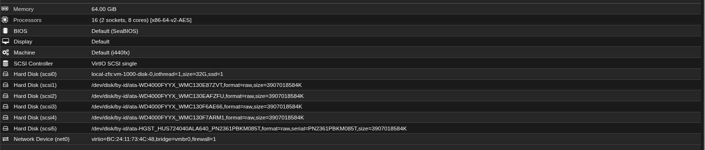
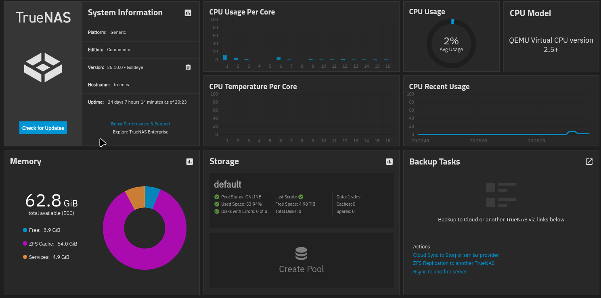
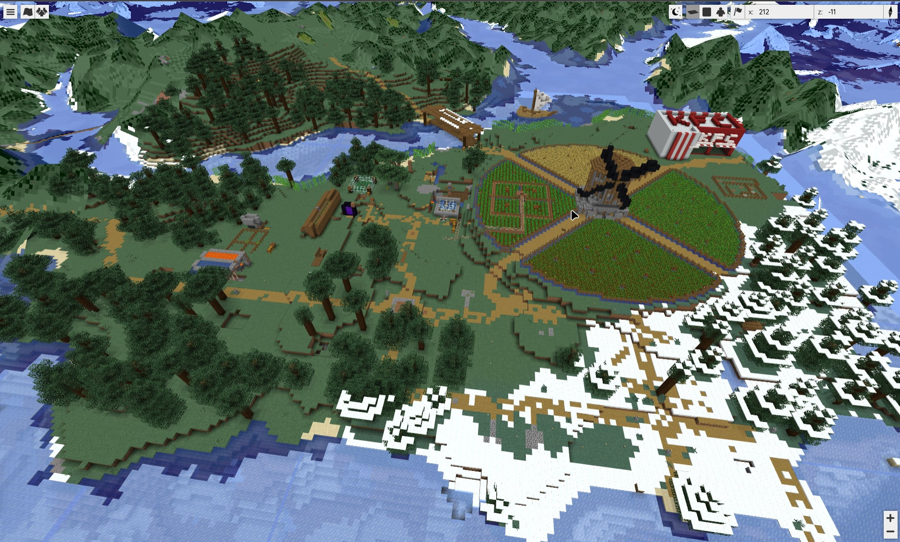

    
Sempre mudando

    Tudo aqui é declarado em um único flake que não para de evoluir. O estado atual está no <a href="https://github.com/andre-brandao/nixos">GitHub</a>.

## Visão geral

Um host Proxmox, uma máquina virtual NixOS por serviço, e nada configurado à mão. Adicionar uma máquina é criar uma pasta no flake e rodar o Terraform, que cria a VM, instala o NixOS nela e a mantém atualizada. Tudo conversa por Tailscale com HTTPS de verdade, e os segredos ficam criptografados no repositório.

## Armazenamento

O TrueNAS também roda como VM, com os discos rígidos passados do host como discos inteiros, por id. O ZFS dentro do TrueNAS é dono dos discos físicos, então o pool é o mesmo que seria em uma máquina dedicada e pode migrar para outro hardware sem truques de importação. É o armazenamento principal do lab e também hospeda o bucket MinIO que guarda o estado do Terraform.

## As máquinas

- **mine**: servidor de Minecraft
- **git**: Forgejo com runner do Actions
- **vault**: Vaultwarden e HashiCorp Vault
- **builder**: builder remoto do Nix, usado também pelo meu irmão
- **monitoring**: Prometheus e um gateway LiteLLM

{/* TODO imagem: página inicial do Forgejo / painel do Traefik */}

## O servidor de Minecraft

Declarado com o `nix-minecraft`, então um rebuild reproduz exatamente o mesmo servidor, mods incluídos. Fabric 1.21.11, Lithium para desempenho e BlueMap para um mapa 3D ao vivo do mundo no navegador. Jogadores de Java e Bedrock entram juntos.

## Sempre aprendendo

O lab é onde eu testo coisas novas, então ele nunca fica parado. Para ver o que está em experimento agora, confira o [repositório](https://github.com/andre-brandao/nixos).
