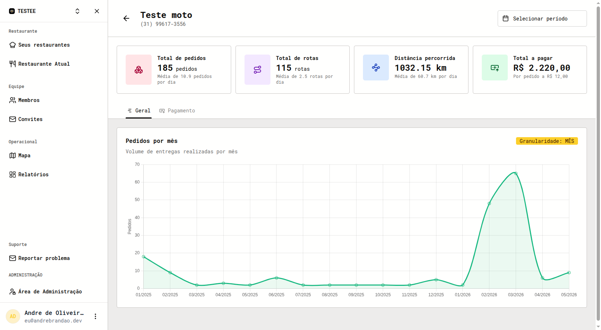

*Desenvolvido junto com meu irmão [Breno Brandão](https://github.com/brenin35).*

## Visão geral

O Rota do Futuro é uma plataforma de logística de entregas para restaurantes. Os pedidos chegam de marketplaces como iFood, Saipos e Open Delivery, são agrupados em rotas otimizadas e despachados para entregadores que as seguem em um app. Quem despacha acompanha tudo em um mapa ao vivo.

O produto tem três partes: a plataforma web para restaurantes e despachantes, o app para entregadores e um armário inteligente para retirada sem contato.

## Plataforma web

- **Mapa ao vivo**: entregadores e pedidos acompanhados em tempo real via WebSockets.
- **Otimização de rotas**: pedidos agrupados em sequências de entrega que minimizam a distância.
- **Quadro de pedidos**: cada pedido passa por pendente, confirmado, pronto, coletado, despachado e concluído.
- **Integrações**: pedidos do iFood, Saipos e Open Delivery sincronizados automaticamente.
- **Relatórios**: entregas, distância percorrida e valores a pagar por entregador em qualquer período.
- **Assistente do administrador**: uma IA que responde perguntas sobre os dados do sistema.

## App do entregador

O entregador recebe as rotas atribuídas no celular, navega parada por parada com o app de mapas de sua preferência e confirma cada entrega. O status volta para o quadro de despacho na hora.

## Armário inteligente

Um armário construído com ESP32 que abre a porta certa quando o entregador coleta um pedido. Ele conversa com a plataforma via MQTT, mantendo o estado das portas e dos pedidos sincronizado com o web e o app.

## Arquitetura

- **Frontend**: SvelteKit na plataforma web, React Native no app do entregador.
- **API**: uma API única com WebSocket para atualizações ao vivo, apoiada por sets no Redis para presença e posições.
- **Banco de dados**: PostgreSQL com PostGIS para consultas geográficas, mais ElectricSQL para sincronização.
- **Mensageria**: RabbitMQ entre o armário, as integrações e a API.
- **Integrações**: webhooks dos marketplaces tratados por AWS Lambda atrás de API Gateway e EventBridge.

## Desafios

- Processar grandes volumes de pedidos mantendo o mapa responsivo.
- Otimização de rotas que continua rápida conforme o número de paradas cresce.
- Trabalho assíncrono confiável entre filas, lambdas e o hardware do armário.
