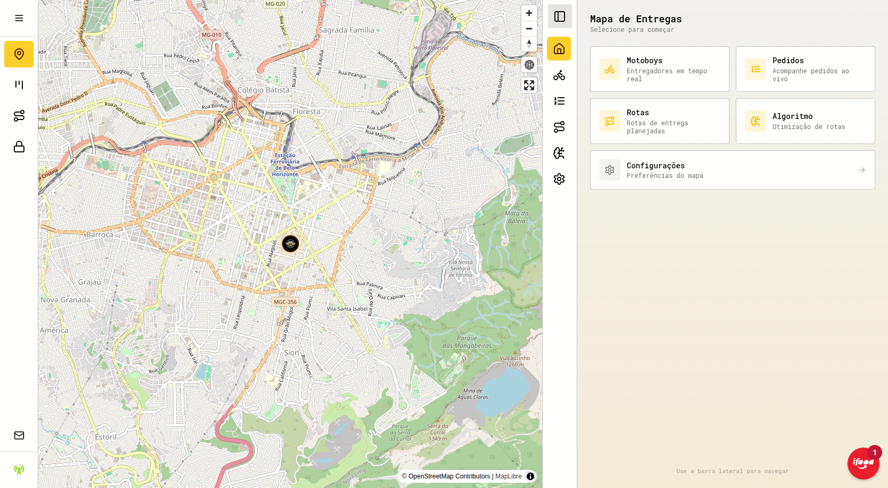
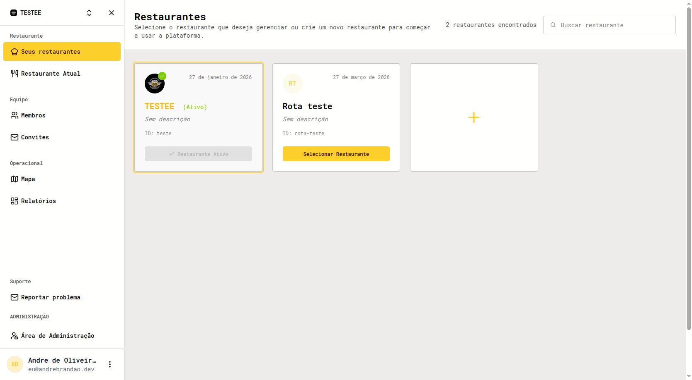
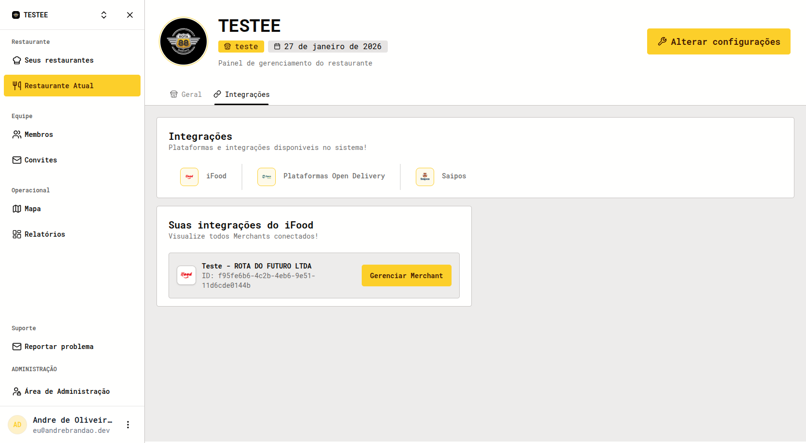
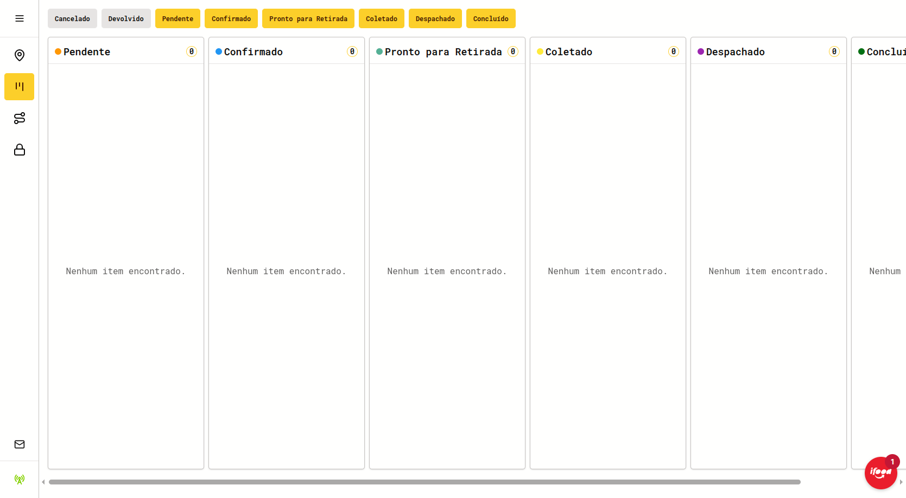
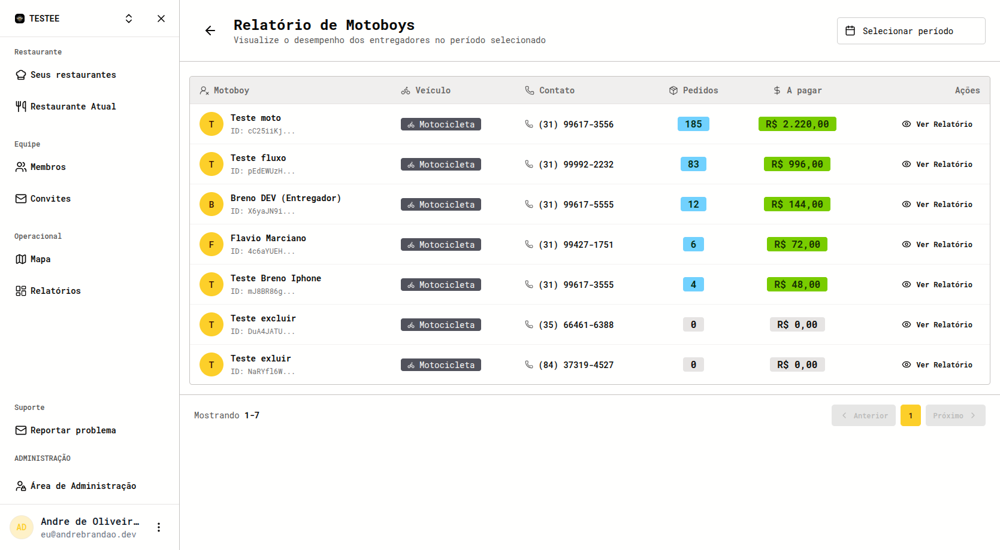
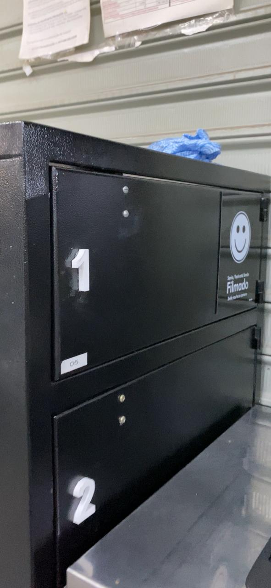

*Built together with my brother [Breno Brandão](https://github.com/brenin35).*

## Overview

A delivery logistics platform for restaurants. Orders arrive from marketplaces, get grouped into optimized routes, and are dispatched to couriers who follow them in a mobile app, while dispatchers watch everything on a live map. It also has a smart locker for contactless pickup.

## Screenshots

## Architecture

